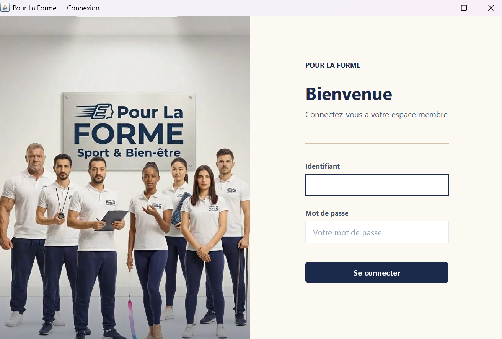
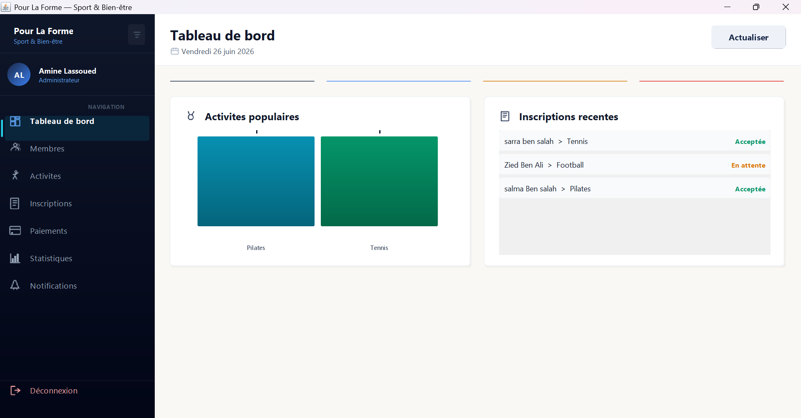
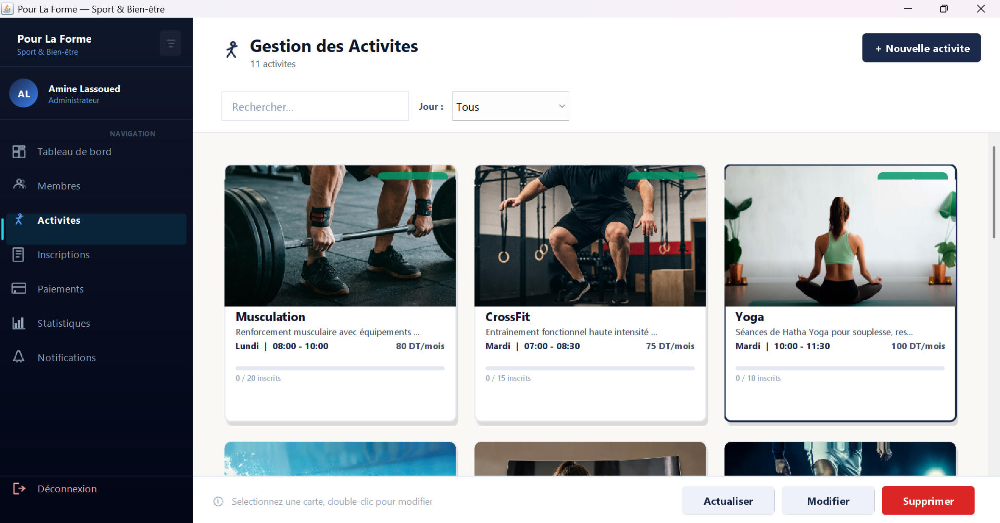
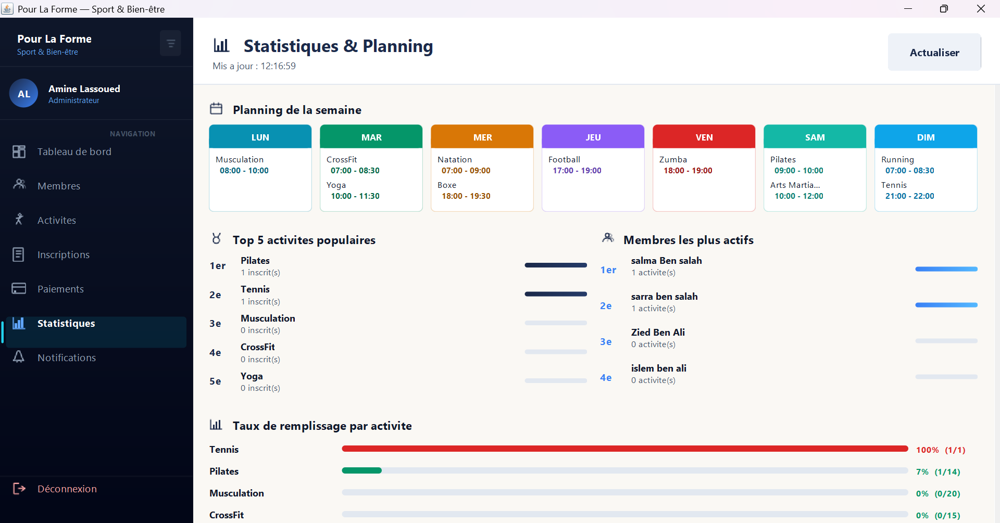
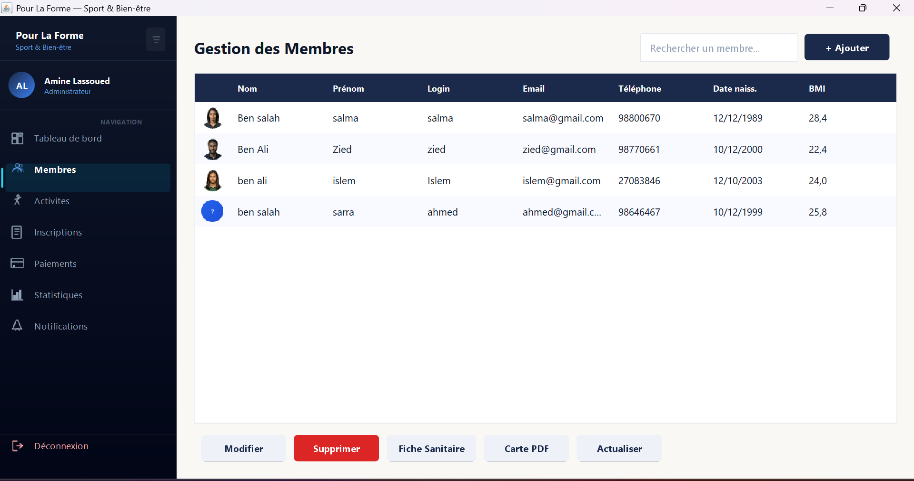
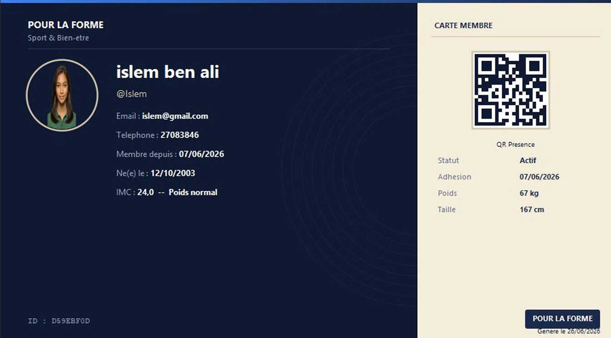
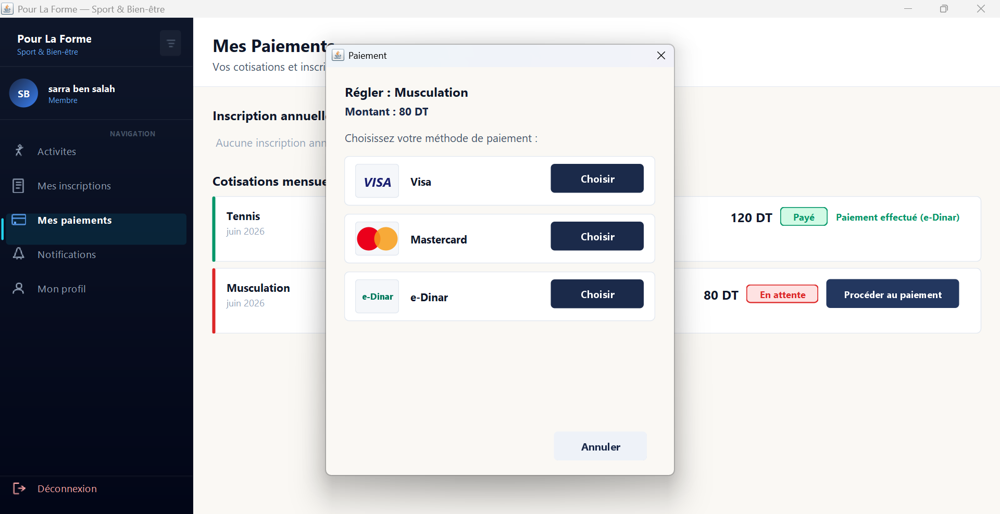
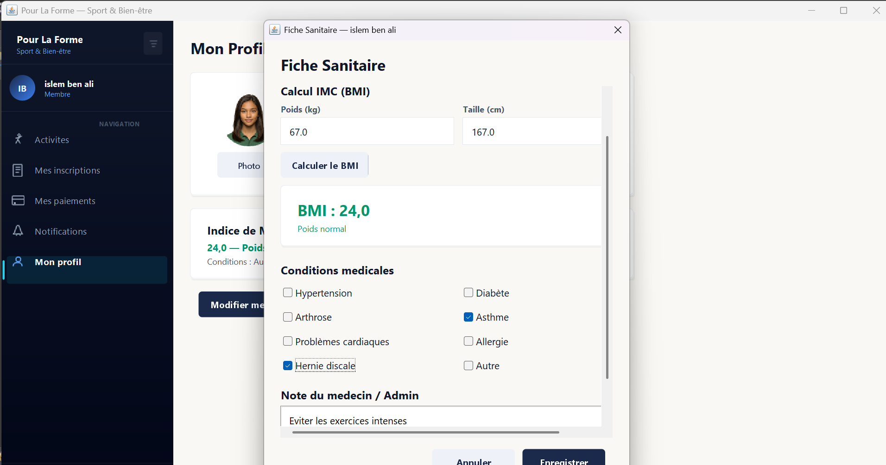
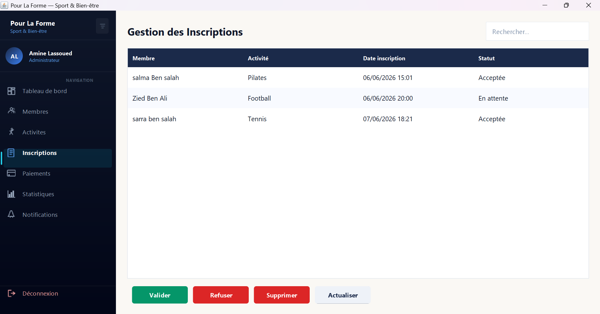
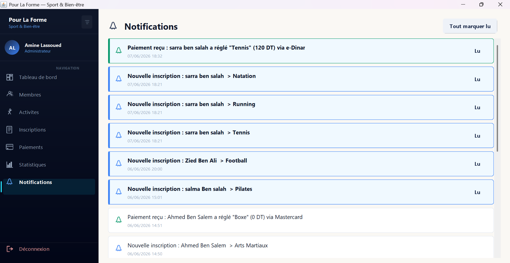

<div align="center">

# 🏋️ Pour La Forme : Sport & Bien-être

**Application desktop de gestion complète d'un club sportif**


<p>
  <b>Pour La Forme</b> est une application desktop Java/Swing permettant la gestion complète d'un club sportif :<br>
  membres, activités, inscriptions, paiements, statistiques, fiches sanitaires et notifications.<br>
  L'application propose deux interfaces distinctes selon le rôle : <b>Administrateur</b> et <b>Membre</b>.
</p>

---

[Fonctionnalités](#-fonctionnalités) •
[Aperçu](#-aperçu) •
[Prérequis](#-prérequis) •
[Installation](#-installation) •
[Structure du projet](#-structure-du-projet) •
[Technologies](#-technologies-utilisées) •
[Auteur](#-auteur)

</div>

---

## 📋 Table des matières

- [Fonctionnalités](#-fonctionnalités)
- [Aperçu](#-aperçu)
- [Prérequis](#-prérequis)
- [Installation](#-installation)
- [Structure du projet](#-structure-du-projet)
- [Architecture](#-architecture)
- [Technologies utilisées](#-technologies-utilisées)
- [Fichiers de données](#-fichiers-de-données)
- [Comptes de démonstration](#-comptes-de-démonstration)
- [Contribuer](#-contribuer)
- [Auteur](#-auteur)

---

## ✨ Fonctionnalités

### 🔑 Espace Administrateur

| Module | Description |
|--------|-------------|
| 📊 **Tableau de bord** | Vue d'ensemble avec activités populaires et inscriptions récentes |
| 👥 **Gestion des membres** | CRUD complet des adhérents avec recherche, photo, BMI et fiche sanitaire |
| 🏅 **Gestion des activités** | Création, modification et suppression des activités sportives avec images |
| 📝 **Gestion des inscriptions** | Validation, refus et suivi des demandes d'inscription |
| 💳 **Gestion des paiements** | Suivi des cotisations mensuelles, génération automatique et total encaissé |
| 📈 **Statistiques & Planning** | Planning hebdomadaire, top activités, membres actifs et taux de remplissage |
| 🔔 **Notifications** | Centre de notifications avec paiements reçus et nouvelles inscriptions |
| 🪪 **Carte membre PDF** | Génération de cartes de membre avec QR code de présence |

### 👤 Espace Membre

| Module | Description |
|--------|-------------|
| 🏅 **Activités disponibles** | Consultation et inscription aux activités avec places disponibles |
| 📝 **Mes inscriptions** | Suivi de ses propres inscriptions et statuts |
| 💳 **Mes paiements** | Visualisation des cotisations et paiement en ligne (Visa, Mastercard, e-Dinar) |
| 🏥 **Fiche sanitaire** | Calcul IMC (BMI), conditions médicales et notes du médecin |
| 👤 **Mon profil** | Gestion du profil, photo, modification des infos et changement de mot de passe |
| 🔔 **Notifications** | Réception des notifications personnalisées |

---

## 📸 Aperçu

### Écran de connexion
<div align="center">
  
</div>

<br>

### Tableau de bord (Admin)
<div align="center">
  
</div>

<br>

### Gestion des activités
<div align="center">
  
</div>

<br>

### Statistiques & Planning
<div align="center">
  
</div>

<br>

### Gestion des membres
<div align="center">
  
</div>

<br>

### Carte membre générée (PDF avec QR Code)
<div align="center">
  
</div>

<br>

<details>
<summary>📷 <b>Voir plus de captures d'écran</b></summary>

<br>

### Paiement — Choix de la méthode
<div align="center">
  
</div>

<br>

### Fiche sanitaire (IMC & Conditions médicales)
<div align="center">
  
</div>

<br>

### Gestion des inscriptions (Admin)
<div align="center">
  
</div>

<br>

### Centre de notifications
<div align="center">
  
</div>

</details>

---

## 📦 Prérequis

Avant de commencer, assurez-vous d'avoir installé :

| Outil | Version minimale | Lien |
|-------|-----------------|------|
| ☕ **JDK** | 21+ | [Télécharger](https://jdk.java.net/21/) |
| 🌘 **Eclipse IDE** | 2024+ (recommandé) | [Télécharger](https://www.eclipse.org/downloads/) |

> **Note :** Tout IDE Java compatible (IntelliJ IDEA, VS Code + Extension Pack for Java, NetBeans) peut également être utilisé.

---

## 🚀 Installation

### 1. Cloner le dépôt

```bash
git clone https://github.com/eyahouri48/club_sportif.git
cd club_sportif
```

### 2. Importer dans Eclipse

1. Ouvrir Eclipse IDE
2. `File` → `Import` → `Existing Projects into Workspace`
3. Sélectionner le dossier `club_sportif` cloné
4. Cocher le projet détecté puis cliquer sur **Finish**

### 3. Configurer le JDK

1. Clic droit sur le projet → `Properties`
2. `Java Build Path` → Onglet `Libraries`
3. Vérifier que le **JDK 21** est bien configuré

### 4. Lancer l'application

1. Naviguer vers la classe principale contenant la méthode `main`
2. Clic droit → `Run As` → `Java Application`

> 💡 **Le dossier `data/` et ses fichiers `.dat` sont générés automatiquement au premier lancement** via la classe `DataInitializer`. Il n'est pas nécessaire de les créer manuellement.

---

## 🗂 Structure du projet

```
club_sportif/
│
├── 📁 club-sportif/
│   └── 📁 src/
│       └── 📁 com/clubsportif/
│           │
│           ├── 📁 ui/                              ← Interface utilisateur
│           │   ├── MainFrame.java                   ← Fenêtre principale de l'application
│           │   ├── LoginPanel.java                  ← Écran de connexion
│           │   ├── ProfilePanel.java                ← Profil membre (infos + BMI)
│           │   ├── MemberListPanel.java             ← Liste et recherche des membres
│           │   ├── MemberFormDialog.java            ← Formulaire ajout / modification
│           │   ├── MembreActivitesPanel.java        ← Activités disponibles (vue membre)
│           │   ├── MembreInscriptionsPanel.java     ← Inscriptions du membre connecté
│           │   ├── InscriptionAdminPanel.java       ← Administration des inscriptions
│           │   ├── PaiementAdminPanel.java          ← Administration des paiements
│           │   ├── PaiementMembrePanel.java         ← Paiements côté membre
│           │   ├── PaiementDialog.java              ← Dialogue de paiement (Visa/MC/e-Dinar)
│           │   ├── NotificationsPanel.java          ← Centre de notifications
│           │   │
│           │   └── 📁 components/                   ← Composants UI réutilisables
│           │       ├── ActivityCard.java             ← Carte d'affichage d'activité
│           │       ├── CardPanel.java                ← Panneau stylisé en carte
│           │       ├── DataTable.java                ← Tableau de données personnalisé
│           │       ├── DialogUtils.java              ← Utilitaires pour dialogues
│           │       ├── FormBuilder.java              ← Construction dynamique de formulaires
│           │       ├── InputFilters.java             ← Filtres de validation des champs
│           │       ├── ScrollableWrapPanel.java      ← Panneau scrollable avec wrap
│           │       ├── StyledButton.java             ← Bouton avec style personnalisé
│           │       ├── StyledPasswordField.java      ← Champ mot de passe stylisé
│           │       └── StyledTextField.java          ← Champ texte stylisé
│           │
│           └── 📁 util/                             ← Classes utilitaires
│               ├── DataInitializer.java              ← Initialisation des données par défaut
│               ├── IconFactory.java                  ← Gestion centralisée des icônes
│               ├── PdfCardGenerator.java             ← Génération de cartes PDF + QR code
│               ├── PhotoUtils.java                   ← Traitement des photos membres
│               ├── Session.java                      ← Gestion de la session utilisateur
│               ├── SportImageGenerator.java          ← Génération d'images sportives
│               ├── Theme.java                        ← Thème et constantes visuelles
│               └── Validator.java                    ← Validation des entrées utilisateur
│
├── 📁 data/                                         ← Données persistantes (générées à l'exécution)
├── 📁 screenshots/                                  ← Captures d'écran du projet
├── .gitignore
├── .classpath
├── .project
└── README.md
```

---

## 🏗 Architecture

L'application suit une architecture en **couches** organisée par responsabilité, avec une séparation claire entre les vues Administrateur et Membre :

```
┌──────────────────────────────────────────────────────────────┐
│                      Authentification                        │
│                   LoginPanel · Session                       │
├────────────────────────┬─────────────────────────────────────┤
│   👔 Vue Administrateur │         👤 Vue Membre               │
│  ─────────────────────  │  ──────────────────────────────── │
│  Tableau de bord        │  Activités disponibles             │
│  Gestion des membres    │  Mes inscriptions                  │
│  Gestion des activités  │  Mes paiements                     │
│  Inscriptions (admin)   │  Mon profil + Fiche sanitaire      │
│  Paiements (admin)      │  Notifications                     │
│  Statistiques & Planning│                                    │
│  Notifications          │                                    │
├────────────────────────┴─────────────────────────────────────┤
│                    Composants UI partagés                     │
│  ActivityCard · DataTable · FormBuilder · StyledButton · ...│
├──────────────────────────────────────────────────────────────┤
│                     Couche Utilitaire                         │
│  Validator · Theme · IconFactory · PdfCardGenerator · ...    │
├──────────────────────────────────────────────────────────────┤
│                   Persistance (Sérialisation)                 │
│  DataInitializer → fichiers .dat (data/)                     │
└──────────────────────────────────────────────────────────────┘
```

| Couche | Package | Rôle |
|--------|---------|------|
| **UI** | `com.clubsportif.ui` | Fenêtres, panneaux et dialogues Swing |
| **Components** | `com.clubsportif.ui.components` | Composants graphiques réutilisables |
| **Utilitaires** | `com.clubsportif.util` | Logique métier, validation, session, thème, PDF |
| **Données** | `data/` | Fichiers `.dat` sérialisés (persistance locale) |

---

## 🛠 Technologies utilisées

<div align="center">

| Technologie | Utilisation |
|:-----------:|:-----------:|
|  | Langage principal |
|  | Interface graphique desktop |
|  | Persistance des données |
|  | Cartes de membre avec QR code |
|  | Environnement de développement |
|  | Contrôle de version |

</div>

---

## 💾 Fichiers de données

L'application utilise la **sérialisation Java** pour persister les données localement dans le dossier `data/`. Ces fichiers sont générés automatiquement au premier lancement via `DataInitializer`.

| Fichier | Contenu |
|---------|---------|
| `activites.dat` | Liste des activités sportives (horaires, tarifs, capacité) |
| `membres.dat` | Données des membres (profil, photo, BMI, conditions médicales) |
| `inscriptions.dat` | Associations membres ↔ activités avec statut |
| `paiements.dat` | Historique des transactions et cotisations |
| `notifications.dat` | Notifications (inscriptions, paiements reçus) |

> ⚠️ **Ces fichiers sont exclus du dépôt via `.gitignore`** car ils contiennent des données locales propres à chaque instance de l'application.

---

## 🧪 Comptes de démonstration

L'application crée des comptes par défaut au premier lancement via `DataInitializer`. Consultez cette classe pour connaître les identifiants de connexion pré-configurés (administrateur et membres).

---

## 🤝 Contribuer

Les contributions sont les bienvenues ! Voici comment participer :

1. **Forker** le projet
2. Créer une **branche** pour votre fonctionnalité
   ```bash
   git checkout -b feature/ma-nouvelle-fonctionnalite
   ```
3. **Committer** vos modifications
   ```bash
   git commit -m "feat: ajout de ma nouvelle fonctionnalité"
   ```
4. **Pusher** sur votre fork
   ```bash
   git push origin feature/ma-nouvelle-fonctionnalite
   ```
5. Ouvrir une **Pull Request**

---

## 👤 Auteur

<a href="https://github.com/eyahouri48">
  
</a>

---

<div align="center">

⭐ **Si ce projet vous est utile, n'hésitez pas à lui donner une étoile !** ⭐

</div>
